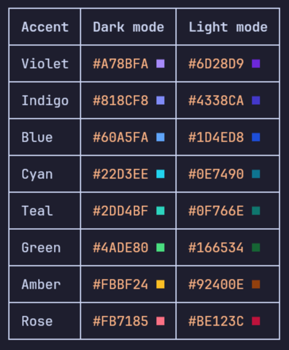

# pi Markdown color swatches

This pi extension appends a colored `■` swatch to CSS color literals in user and assistant Markdown. It is display-only: the original Markdown stored in the session and sent to the model is not changed.

## Install and use

From this directory, build and load it with:

```sh
npm install
npm run build
pi -e ./src/index.ts
```

The pi package manifest loads the included TypeScript source directly. The build remains useful for typechecking and tests.

## Example



## Supported syntax

- Hex: `#RGB`, `#RGBA`, `#RRGGBB`, and `#RRGGBBAA` (case preserved)
- Comma syntax: `rgb(10, 20, 30)` and `rgba(10, 20, 30, .5)`
- Space/slash syntax: `rgb(10 20 30 / 50%)` and `rgba(10% 20% 30% / 50%)`
- Standalone inline code spans containing supported literals, for example ``#RGB``

RGB channels accept integers from 0–255 or percentages from 0–100. Alpha accepts numbers from 0–1 or percentages from 0–100. Invalid values and color-looking parts of longer identifiers are left unchanged. Alpha is shown as a rounded integer percentage (nearest integer, with exact halves rounded up), for example `#00000080 ■ 50%`.

## Terminal behavior and limitations

Truecolor terminals receive an RGB foreground escape; other terminals receive the nearest color from the conventional ANSI-256 palette. Only the square's foreground is reset, so surrounding terminal styles are disturbed as little as possible.

The transformer runs on raw Markdown before pi's Markdown renderer. Standalone inline code spans containing only a supported color literal are transformed by appending the swatch after the closing backticks; other inline, indented, and nested fenced code remains protected. Balanced link/reference labels and destinations; reference definitions; HTML tags and raw HTML blocks; autolinks; and ordinary URLs are also protected. Colors in normal Markdown text are transformed. The renderer has no API for restoring an arbitrary active foreground after a raw ANSI reset, so the transformer adds an invisible empty-link marker after a swatch; pi-tui uses that token to reapply its current style prefix without displaying markup. Already generated swatches are recognized, so transformer reruns do not duplicate them. While assistant text is streaming, an ambiguous hex literal at the end (`#RGB`, `#RGBA`, or `#RRGGBB`) is held back until a delimiter or more text arrives.
